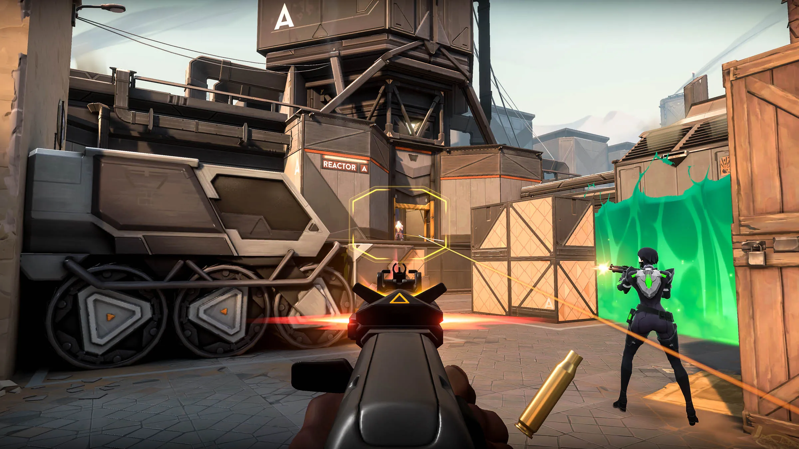
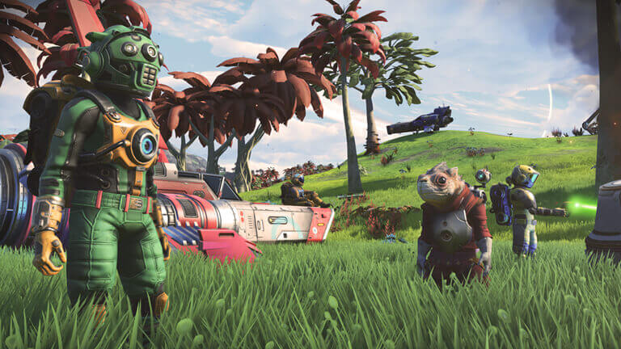

# PEC3_Manovich_Reloaded
PEC3_Manovich_Reloaded

**Autor:** Luis Reyes Pajuelo
**Asignatura:** Cultura Digital 
**Fecha:** 19 de diciembre de 2025

---

## Introducción

En *El software toma el mando*, Lev Manovich plantea que el software no es solo una herramienta técnica, sino una fuerza cultural capaz de transformar, recombinar e hibridar medios preexistentes. Uno de los conceptos centrales de su análisis es la **hibridación**, entendida no como una simple suma de medios, sino como una **remezcla profunda**, donde las lógicas del software reconfiguran prácticas culturales previas hasta generar nuevas formas que no pueden reducirse a sus antecedentes.

Este trabajo analiza dos casos contemporáneos de hibridación no abordados directamente por Manovich: **Valorant** (Riot Games) y **No Man’s Sky** (Hello Games). Ambos videojuegos permiten observar cómo el software actúa como un metamedio que integra acción, comunicación, simulación, visualización de datos y procesos algorítmicos, produciendo experiencias culturales imposibles fuera del entorno computacional.

---

## Caso 1: Valorant – El shooter táctico como sistema híbrido de acción, datos y comunicación digital

Valorant, desarrollado por Riot Games, se presenta inicialmente como un videojuego de disparos en primera persona, heredero de una tradición que incluye títulos como *Counter-Strike*. Sin embargo, reducirlo a un simple shooter sería ignorar su verdadera naturaleza como **objeto híbrido**, en el que confluyen mecánicas de acción en tiempo real, habilidades propias de cada personaje, visualización constante de datos y sistemas de comunicación digital integrados.

Desde la perspectiva de Manovich, Valorant no funciona como un medio aislado, sino como una **plataforma de remezcla profunda**. El juego integra múltiples lógicas culturales: la del videojuego competitivo, la del deporte electrónico profesionalizado, la de la comunicación en red y la de la gestión de información en tiempo real. Estas capas no coexisten de forma superficial, sino que se influyen mutuamente de manera estructural.

Uno de los conceptos clave para analizar este caso es la **modularidad**. Valorant está construido a partir de módulos claramente definidos: agentes, habilidades, armas, mapas, rondas y sistemas de puntuación. Cada uno de estos elementos puede entenderse como una unidad independiente, pero es el software quien se encarga de combinarlos dinámicamente durante la partida. El resultado no es una narrativa cerrada, sino un sistema abierto donde cada sesión emerge de la interacción entre módulos y jugadores.

La **variabilidad**, otro principio manovichiano, se manifiesta de forma radical. Aunque el escenario y las reglas básicas se repiten, cada partida es irrepetible. Las decisiones tácticas, la coordinación entre jugadores, el uso de habilidades y la comunicación en tiempo real generan configuraciones siempre distintas. El juego no ofrece una experiencia fija, sino un espacio de posibilidades gestionado algorítmicamente.

En cuanto a la **transcodificación**, es importante evitar una interpretación simplificada. En Valorant no se trata únicamente de convertir datos en gráficos. Lo que ocurre es un proceso más profundo: acciones humanas (movimiento, estrategia, comunicación) se traducen en datos computacionales que, a su vez, reorganizan la experiencia visual, sonora y espacial del juego. El software actúa como mediador entre la lógica cultural del jugador y la lógica numérica del sistema, imponiendo sus propias reglas de interpretación.

Además, Valorant introduce una dimensión híbrida esencial: la **comunicación digital integrada**. El chat de voz, las señales visuales y los indicadores de información no son añadidos externos, sino parte del propio diseño del juego. La comunicación deja de ser un elemento social externo y pasa a convertirse en una mecánica central, regulada y estructurada por el software.

Finalmente, Valorant puede entenderse como un ejemplo de cómo el software produce nuevas formas culturales que desdibujan fronteras tradicionales: ya no es solo un videojuego, ni solo un espectáculo competitivo, ni solo una red social, sino un sistema híbrido donde acción, datos y comunicación convergen bajo una lógica computacional.

---

## Caso 2: No Man’s Sky – El universo procedural como hibridación entre simulación, exploración y lógica algorítmica

No Man’s Sky, desarrollado por Hello Games, representa uno de los ejemplos más claros de hibridación profunda en el ámbito del videojuego contemporáneo. Su propuesta se basa en la generación procedural de un universo prácticamente infinito, donde planetas, criaturas, ecosistemas y estructuras no están diseñados manualmente, sino producidos mediante algoritmos.

Desde la óptica de Manovich, este juego no debe entenderse solo como una experiencia lúdica, sino como un **sistema híbrido entre simulación científica, exploración interactiva y creación artística generativa**. El software no se limita a representar un mundo, sino que lo construye dinámicamente siguiendo reglas matemáticas y probabilísticas.

La **modularidad** es uno de los pilares del sistema. Los planetas se componen de módulos como clima, terreno, flora, fauna y recursos. Estos elementos no existen de forma aislada, sino que son combinados por el algoritmo para generar configuraciones únicas. El diseñador no controla el resultado final, sino las reglas que rigen la combinación de módulos, delegando la autoría parcial al software.

La **variabilidad** alcanza aquí una escala extrema. No existen dos universos iguales, ni siquiera dos experiencias idénticas dentro del mismo universo. Cada jugador explora mundos distintos, toma decisiones diferentes y construye narrativas emergentes que no estaban predefinidas. El juego abandona la lógica lineal tradicional y adopta una estructura abierta, propia de los sistemas computacionales complejos.

En relación con la **transcodificación**, No Man’s Sky ejemplifica cómo conceptos abstractos como ecuaciones, semillas algorítmicas y datos numéricos se transforman en paisajes, sonidos y comportamientos aparentemente orgánicos. No se trata solo de visualización, sino de una traducción profunda entre la lógica matemática del código y la experiencia sensorial del jugador.

Además, el juego introduce una dimensión cultural relevante: la exploración como práctica mediada por el software. Actividades tradicionalmente humanas —descubrir, catalogar, nombrar— son reorganizadas por el sistema computacional. El jugador actúa como explorador, pero siempre dentro de los límites y posibilidades definidos por el algoritmo.

No Man’s Sky también puede entenderse como una obra artística generativa. El universo no es una representación estática, sino un proceso en constante ejecución. El software se convierte en el verdadero autor del mundo, mientras que el jugador ocupa un rol híbrido entre usuario, explorador y co-creador.

En definitiva, No Man’s Sky ejemplifica de forma clara la idea de Manovich de que el software no solo remedia medios previos, sino que crea **nuevas formas culturales** basadas en la lógica algorítmica, donde simulación, arte y juego se fusionan de manera inseparable.

---

## Recursos y enlaces

### Valorant
- Web oficial: https://playvalorant.com  
- Tráiler oficial: https://www.youtube.com/watch?v=e_E9W2vsRbQ  

### No Man’s Sky
- Web oficial: https://www.nomanssky.com  
- Tráiler oficial: https://www.youtube.com/watch?v=nLtmEjqzg7M  

---

## Licencia

Este trabajo se publica bajo una licencia **Creative Commons**, permitiendo su reutilización con fines educativos y no comerciales.
